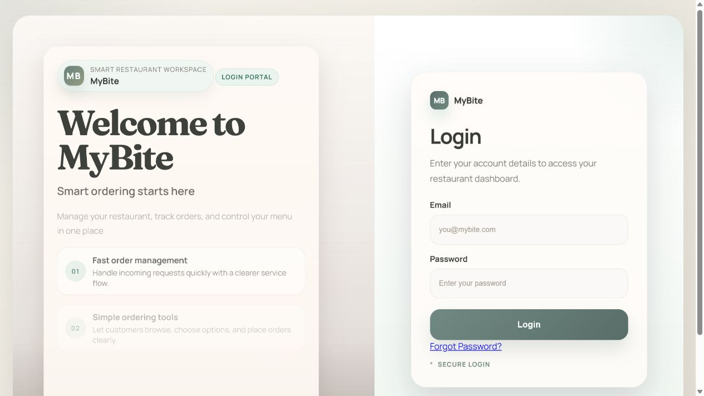
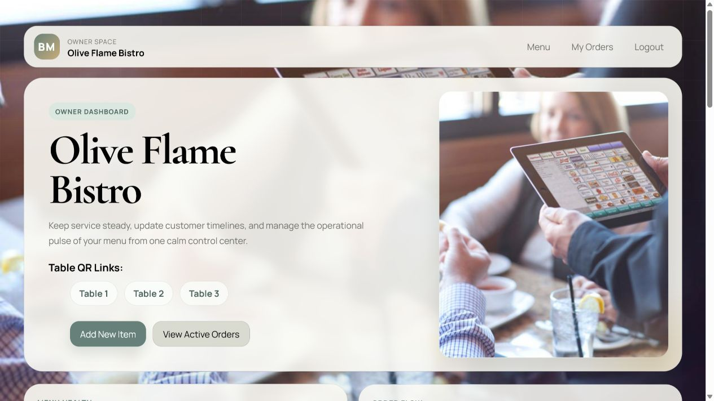
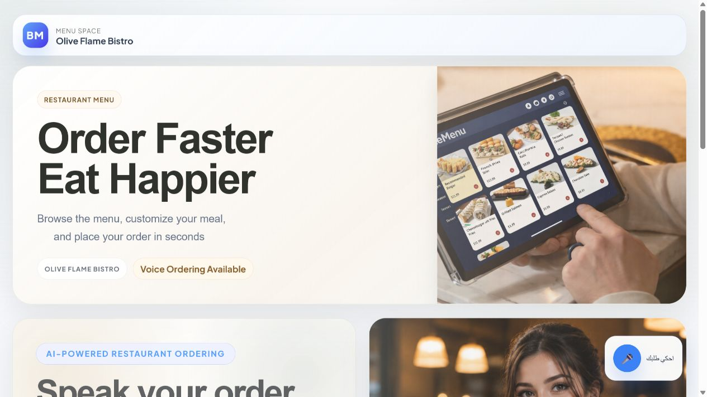
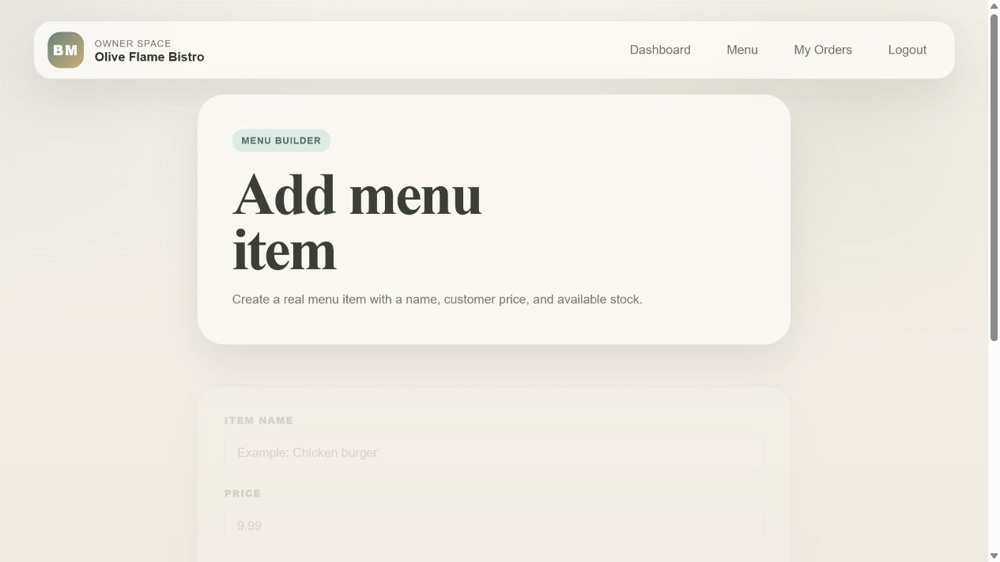
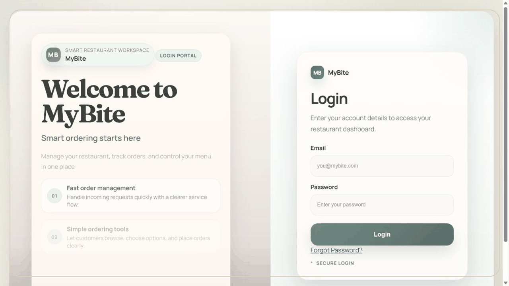

# BiteMenu 🍽️

A modern Django-based restaurant ordering and management platform designed to simplify both customer ordering and restaurant operations.

BiteMenu provides a complete digital dining experience, allowing restaurant owners to manage menus and orders while enabling customers to browse menus, customize meals, and place orders through an intuitive interface with optional Arabic voice ordering.

---

## ✨ Features

### Restaurant Management

* Create and manage restaurants
* Owner dashboard with business insights
* Restaurant notes and management tools
* Public restaurant pages for customers

### Menu Management

* Create, edit, and remove menu items
* Configure dynamic option groups (sizes, add-ons, sauces, extras)
* Control item availability and stock
* Organize menu categories

### Customer Experience

* Browse restaurant menus
* Customize menu items before ordering
* Table-based ordering sessions
* Track order status in real time
* Responsive user interface for desktop and mobile

### Voice Ordering

* Arabic voice-assisted ordering
* Speech-to-text interaction
* Text-to-speech responses
* Voice command processing for menu selection

### Authentication & Security

* Secure authentication
* Email password reset
* Environment-based secret management
* Password hashing using bcrypt

### Order Management

* Pending
* Confirmed
* Preparing
* Ready
* Completed
* Cancelled

---

# Tech Stack

### Backend

* Python
* Django

### Frontend

* HTML5
* CSS3
* Vanilla JavaScript
* SVG Animations
* requestAnimationFrame

### Database

* SQLite (development)

### APIs & Services

* ElevenLabs API
* SMTP Email
* python-dotenv

### Security

* bcrypt

---

# Installation

## Clone the repository

```bash
git clone https://github.com/karimsajaber-cyber/BiteMenu.git
cd BiteMenu
```

## Create a virtual environment

```bash
python -m venv .venv
```

### Windows

```bash
.venv\Scripts\activate
```

### macOS / Linux

```bash
source .venv/bin/activate
```

## Install dependencies

```bash
pip install -r requirements.txt
```

## Configure environment variables

Create a `.env` file in the project root.

```env
ELEVENLABS_API_KEY=your_api_key
ELEVENLABS_VOICE_ID=your_voice_id

BITEMENU_EMAIL=your_email@example.com
BITEMENU_EMAIL_PASSWORD=your_app_password

ELEVENLABS_TTS_MODEL=eleven_flash_v2_5
ELEVENLABS_LANGUAGE_CODE=ar
```

## Apply migrations

```bash
python manage.py migrate
```

## Run the development server

```bash
python manage.py runserver
```

Visit:

```
http://127.0.0.1:8000/
```

---

# Project Structure

```
BiteMenu
│
├── Bite_menu/
├── my_bite/
│   ├── migrations/
│   ├── static/
│   ├── templates/
│   ├── models.py
│   ├── views.py
│   └── urls.py
│
├── manage.py
├── requirements.txt
├── .env.example
└── README.md
```

---

# Screenshots

## Home Page



## Owner Dashboard



## Restaurant Page



## Voice Ordering


## Item Management Page



## Demo GIF



---

# Future Improvements

* QR Code generation for restaurant tables
* Online payment integration
* Multi-language support
* Restaurant analytics dashboard
* Customer favorites
* Order history improvements
* Notifications
* Docker deployment
* PostgreSQL production configuration

---

# Notes

* Voice ordering requires valid ElevenLabs credentials.
* Password reset requires SMTP email configuration.
* SQLite is used for development. PostgreSQL is recommended for production deployments.

---

# Author

**Karim Jaber**

Full-Stack Developer

GitHub:
https://github.com/karimsajaber-cyber

LinkedIn:
https://www.linkedin.com/in/karim-jaber-b90a65125/

---

# License

This project is intended for educational and portfolio purposes and for production purposes.
